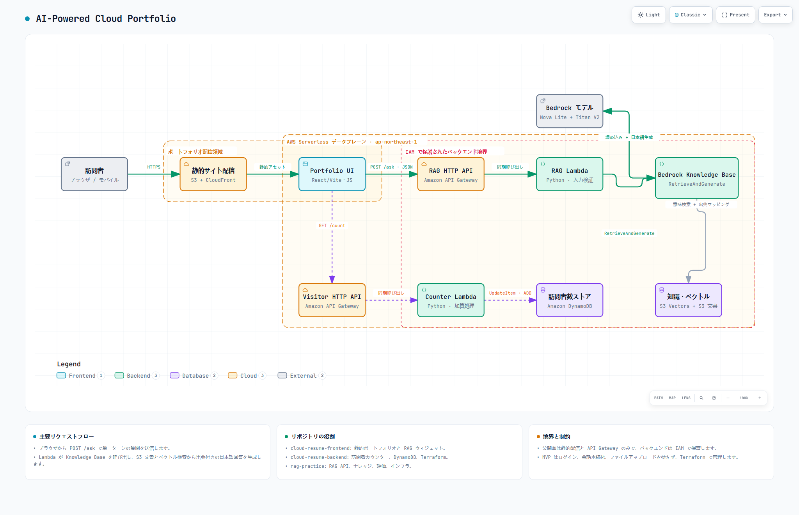

# Cloud Resume Challenge — Frontend

日本語 | [English](./README.en.md)

AWS 上で配信する日本語のクラウド履歴書です。HTML/CSS/JavaScript の静的サイトに、訪問者カウンターと履歴書 RAG アシスタントを統合しています。

**Demo:** https://dyp8879eswsdu.cloudfront.net/

## システム全体像

[](docs/architecture/AI-Powered-Cloud-Portfolio.html)

画像をクリックするとインタラクティブ版を開けます。このリポジトリは静的サイト配信、Portfolio UI、2つの API クライアントを担当します。

## フロントエンドの役割

- Amazon S3 と CloudFront から履歴書の静的アセットを配信
- `GET /count` で訪問者数を取得・表示
- `POST /ask` で単一ターンの質問を RAG API に送信
- 日本語の回答、出典、読み込み状態、エラー状態を表示
- Shadow DOM を使ったフレームワーク非依存の RAG ウィジェット
- モバイル表示とキーボード操作に対応

## 主なファイル

```text
index.html       履歴書のメインページ
style.css        サイト固有のスタイル
script.js        訪問者カウンター API クライアント
rag-widget.js    RAG チャット Web Component
assets/          テンプレート、CSS、JavaScript、Web フォント
images/          ポートフォリオ画像
```

## 実行時フロー

```text
Browser → CloudFront → Amazon S3 → Portfolio UI
                                  ├─ GET /count → Counter API
                                  └─ POST /ask  → RAG API
```

ブラウザには AWS 認証情報、Knowledge Base ID、モデル ARN、システムプロンプトを置きません。

## ローカル実行

```powershell
python -m http.server 8000
```

`http://127.0.0.1:8000` を開いてください。RAG API の接続先はページ側の設定で注入します。

## 技術スタック

- HTML5, CSS, Vanilla JavaScript
- Web Components / Shadow DOM
- Amazon S3, Amazon CloudFront
- Amazon API Gateway
- GitHub Actions

## 関連リポジトリ

- [rag-practice](https://github.com/LUOLIFAN-CHUO/rag-practice) — RAG API、ナレッジ、Bedrock インフラ
- [cloud-resume-backend](https://github.com/LUOLIFAN-CHUO/cloud-resume-backend) — 訪問者カウンター API

## アーキテクチャ成果物

- [インタラクティブ HTML](docs/architecture/AI-Powered-Cloud-Portfolio.html)
- [Archify ソース仕様](docs/architecture/AI-Powered-Cloud-Portfolio.architecture.json)
- [PNG プレビュー](docs/architecture/AI-Powered-Cloud-Portfolio.png)
